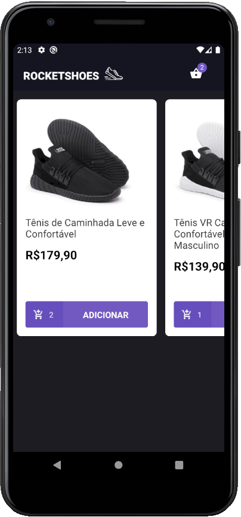
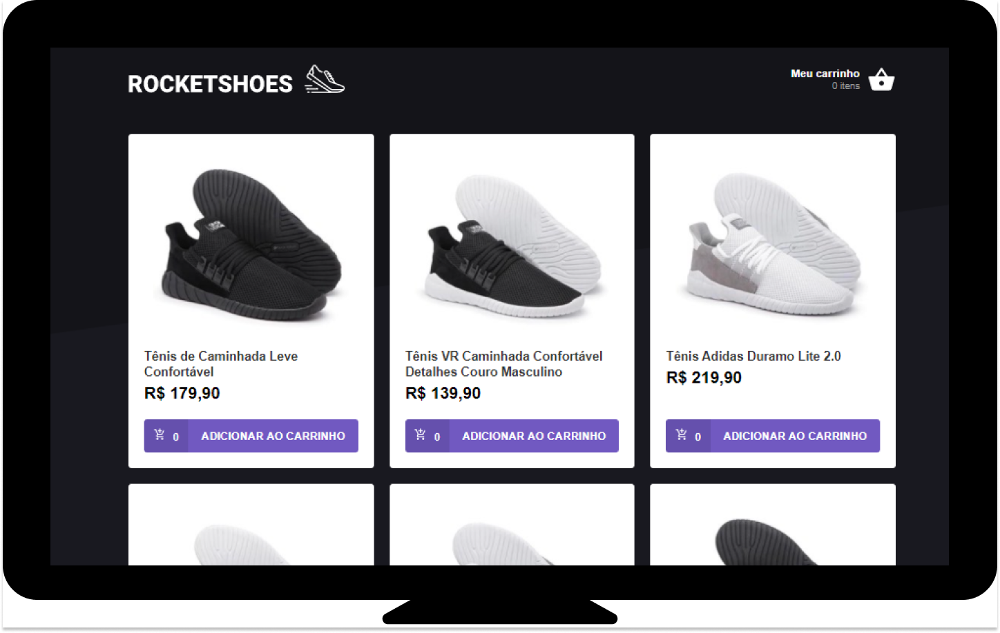
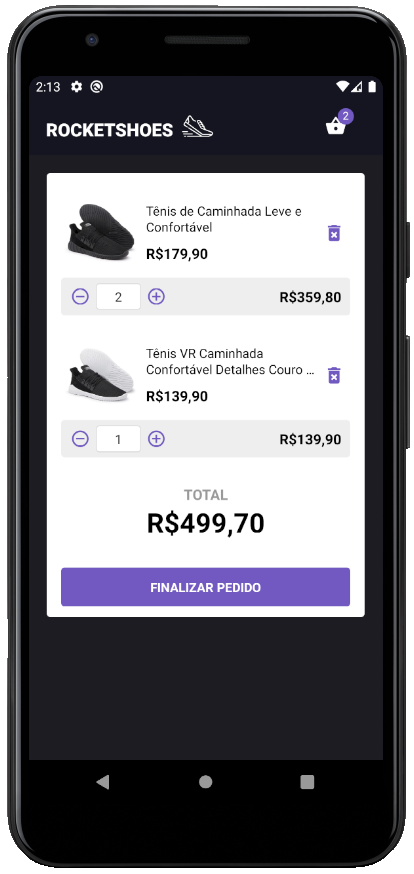
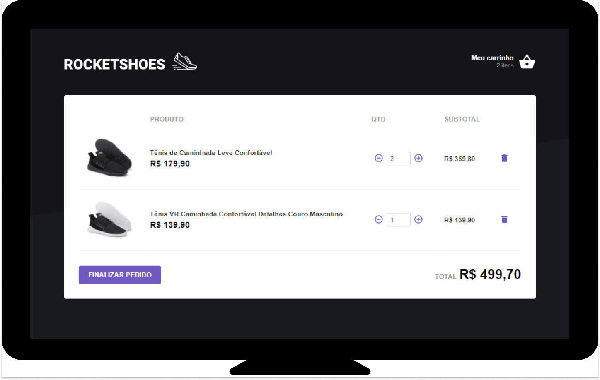
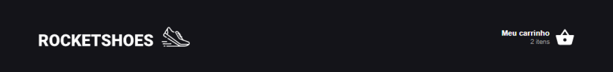

<h1 align="center">
  
</h1>

<h1 align="center">
  Aplicação para um carrinho de compras web e mobile utilizando conceitos de Redux Saga. 
</h3>

## :information_source: Sobre o projeto

- Este projeto apresenta a versão web e mobile do app RocketShoes.
- Este projeto disponibiliza um carrinho de compra de tênis.
- A principal funcionalidade é o uso do framework Redux-Saga.

O projeto apresenta basicamente 3 telas (screens):

### Main/Home:

#### Nesta tela é possível visualizar os produtos disponíveis via API e adicioná-los ao carrinho de compras.

<h3>
  
  
</h3>

### Cart:

#### Nesta tela é possível visualizar os produtos selecionados, acrescentar mais itens aos produto e remover o produto do carrinho de compras.

### Header:

#### No Header do app é possível visualizar quantos produtos foram acrescentados ao carrinho de compra.

## :black_nib: Funcionalidades

1. Selecionar os produtos do app adicionando-os ao carrinho.
2. Acessar no Header (cabeçalho) do app a cesta de produtos.
3. Ao entrar na cesta de carrinho é possivel aumentar a quantidade de itens do produto.
4. O sistema informa ao usuário quanto já não há mais disponibilidade de items para adicionar ao produto ("quantidade solicitada fora de estoque").
5. Também é possível remover o produto da cesta do carrinho. Uma vez sem produtos na cesta o sistema apresenta a mensagem "Seu carrinho está vazio".

## :rocket: Tecnologias

As principais tecnologias/bibliotecas utilizadas são:

- Axios
- PropTypes
- Redux Saga
- react-native-gesture-handler
- MaterialIcons (react-native-vector-icons/MaterialIcons)
- styled-components
- slint + Prettier + Babel

## :construction_worker: Como utilizar

Basta clonar o projeto utilizando o comando abaixo:

git clone https://github.com/edenex/bootcamp-gostack-modulo-07.git

## :memo: Licença

Esse projeto está sob a licença MIT. Veja o arquivo [LICENSE](LICENSE.md) para mais detalhes.

---

Feito com 🧡 by [Edenir de Souza](https://github.com/edenex) 😉
